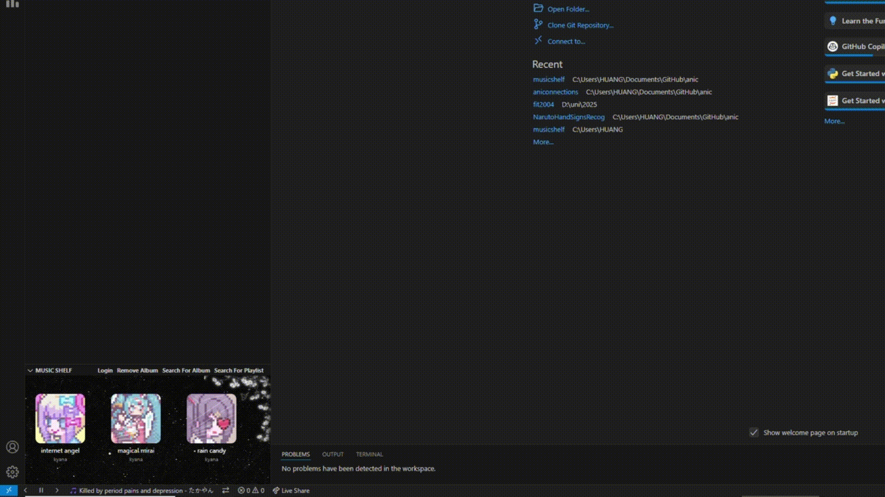
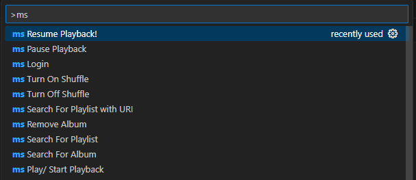

# musicshelf README

**Music Shelf** lets you display your favorite Spotify playlists and albums right in the **VS Code Explorer**, and control playback without leaving your coding flow.

## Installation
Navigate to the VScode Store and search Music Shelf
## Features

- 🔍 **Spotify API Integration**  
  Search for playlists and albums and display them in the VS Code sidebar.

- 🎧 **Full Playback Control**  
  Play, pause, shuffle, skip — all directly inside VS Code.

- 📦 **Explorer Integration**  
  Drag-and-drop layout with album art for a personalized dev workspace.

- 📟 **Status Bar & Terminal Commands**  
  Control your music with quick shortcuts and terminal commands.

## Commands
Find all the commands by hitting ctrl shift p on windows / cmd shift p on mac and typing ms 

## Release Notes

### 1.0.0

Initial release of musicshelf! Thank you for the support

## License:
MIT

---

## Known Issues

Sometimes, you will need to start listening to something on spotify first to use the application
You will need Spotify Premium, due to API restrictions

<!-- ## Working with Markdown

You can author your README using Visual Studio Code. Here are some useful editor keyboard shortcuts:

* Split the editor (`Cmd+\` on macOS or `Ctrl+\` on Windows and Linux).
* Toggle preview (`Shift+Cmd+V` on macOS or `Shift+Ctrl+V` on Windows and Linux).
* Press `Ctrl+Space` (Windows, Linux, macOS) to see a list of Markdown snippets.

## For more information

* [Visual Studio Code's Markdown Support](http://code.visualstudio.com/docs/languages/markdown)
* [Markdown Syntax Reference](https://help.github.com/articles/markdown-basics/)

**Enjoy!** -->
