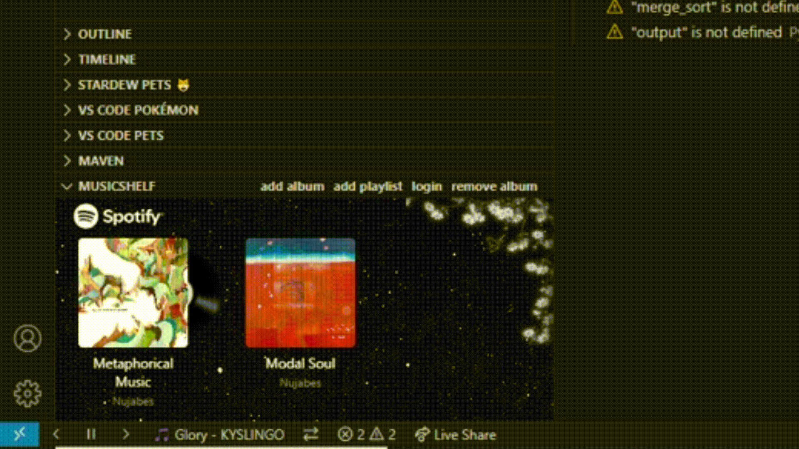

# musicshelf README

**Music Shelf** lets you display your favorite Spotify playlists and albums right in the **VS Code Explorer**, and control playback without leaving your coding flow.

## Installation
Navigate to the VScode Store and search Music Shelf
## Features

- 🔍 **Spotify API Integration**  
  Search for playlists and albums and display them in the VS Code explorer.

- 🎧 **Full Playback Control**  
  Play, pause, shuffle, skip — all directly inside VS Code.

- 📦 **Explorer Integration**  
  Displays album art for a personalized dev workspace with animations.

- 📟 **Status Bar & Terminal Commands**  
  Control your music with quick shortcuts and terminal commands.

## Commands
Find all the commands by hitting ctrl shift p on windows / cmd shift p on mac and typing ms 

- Resume playback : Resumes your spotify listening 

- Pause playback: Pauses your spotify listening

- Login : Logs in to spotify to allow you to access the API

- Turn on shuffle: Turns on shuffle when starting playlists/albums

- Turn off shuffle: Turns off shuffle when starting playlists/albums

- Search for playlist with URI: Asks for an input, a Spotify playlist URI, which can be found in app, and adds that specific playlist

- Remove Album: Type the exact name of the album to remove it from the display

- Search for Playlist: Searches spotify to find your playlist

- Search for Album: Searches spotify to find album

## URI Guide
To add playlists with URI because spotify doesn't index all playlists in search, follow this quick process
Firstly, navigate to your playlist in spotify, and click the three dots and navigate down to share

 

Then hit ALT on your keyboard to copy the URI 

Then use the ms search for playlist with URI function and paste in that URI!

## Release Notes

### 1.0.0

Initial release of musicshelf! Thank you for the support

## License:
MIT

---

## Known Issues

Sometimes, you will need to start listening to something on spotify first to use the application
You will need Spotify Premium, due to API restrictions
Searching playlists you have never listened to will not work properly. Try use URI's to search for playlists

<!-- ## Working with Markdown

You can author your README using Visual Studio Code. Here are some useful editor keyboard shortcuts:

* Split the editor (`Cmd+\` on macOS or `Ctrl+\` on Windows and Linux).
* Toggle preview (`Shift+Cmd+V` on macOS or `Shift+Ctrl+V` on Windows and Linux).
* Press `Ctrl+Space` (Windows, Linux, macOS) to see a list of Markdown snippets.

## For more information

* [Visual Studio Code's Markdown Support](http://code.visualstudio.com/docs/languages/markdown)
* [Markdown Syntax Reference](https://help.github.com/articles/markdown-basics/)

**Enjoy!** -->
